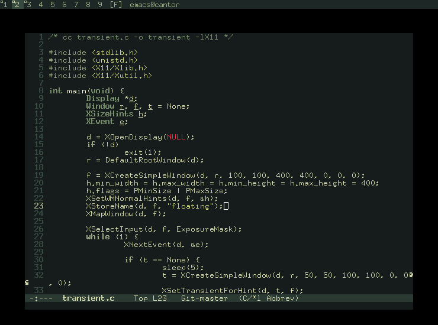

> a theme in deep muted greens.

**Minsk** is a low-ish-contrast theme on a restricted palette,
intended for generic everyday use.  It tries to be almost-monochrome,
and most of the time prefers highlighting by font style over by
colour.

## Screenshot

> minsk applied to [emacs](https://www.gnu.org/software/emacs/) and
  [dwm](https://dwm.suckless.org/).

## Implementations

The theme has been implemented as configuration files for the
following applications:

* [emacs](theme/emacs)
* [dwm](theme/dwm)
* [st](theme/st)
* [xterm](theme/x11)

See the individual directories under `theme/` for installation instructions.
